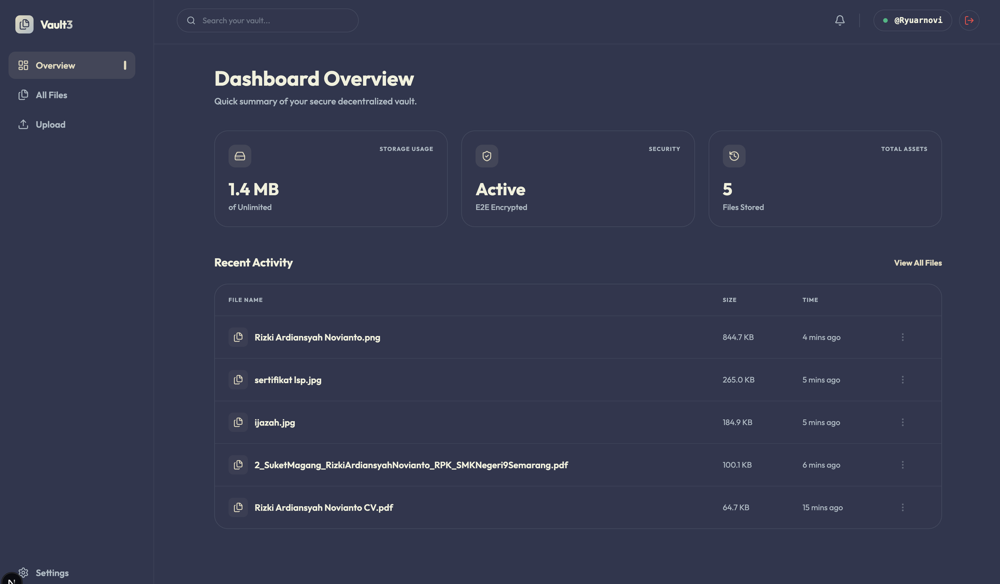
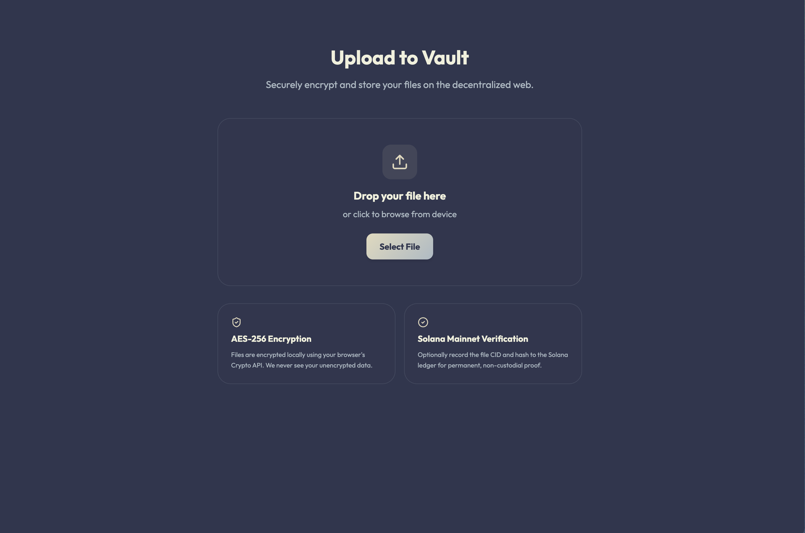

# Vault3 - Secure Web3 Personal Vault

Vault3 is a decentralized, end-to-end encrypted personal file storage solution built on **Solana** and **IPFS (via Pinata)**.




## Features

- 🔐 **End-to-End Encryption**: Files are encrypted in your browser using AES-256 before being uploaded.
- 🌐 **Decentralized Storage**: Files are stored on IPFS, ensuring your data is distributed and resilient.
- ⛓️ **Solana Proof of Existence**: Optionally record your file's CID and hash on the Solana blockchain for immutable proof.
- 🛡️ **Gated Access**: Restricted access to specific Solana wallet addresses (Master Wallet).
- 📁 **Category Management**: Organize your files into categories like Documents, Images, Passcodes, etc.
- ✨ **Premium UI**: Modern macOS-inspired design with glassmorphism and smooth animations.

## Tech Stack

- **Framework**: Next.js 14 (App Router)
- **Blockchain**: Solana (@solana/web3.js)
- **Storage**: IPFS (Pinata)
- **Styling**: Tailwind CSS v4
- **Animations**: Framer Motion
- **Icons**: Lucide React

## Getting Started

### Prerequisites

- Node.js 18+
- Solana Wallet (e.g., Phantom)
- Pinata API Keys

### Environment Variables

Create a `.env` file in the root directory:

```env
PINATA_JWT=your_pinata_jwt
NEXT_PUBLIC_PINATA_GATEWAY=your_pinata_gateway_url
NEXT_PUBLIC_SOLANA_RPC=https://api.mainnet-beta.solana.com
NEXT_PUBLIC_ALLOWED_WALLET=your_authorized_solana_address
```

### Installation

```bash
npm install
npm run dev
```

## Security

Vault3 prioritizes user privacy. Encryption keys never leave your browser. Even if the IPFS gateway or storage provider is compromised, your files remain unreadable without your private key stored in your local vault metadata.

## License

MIT
