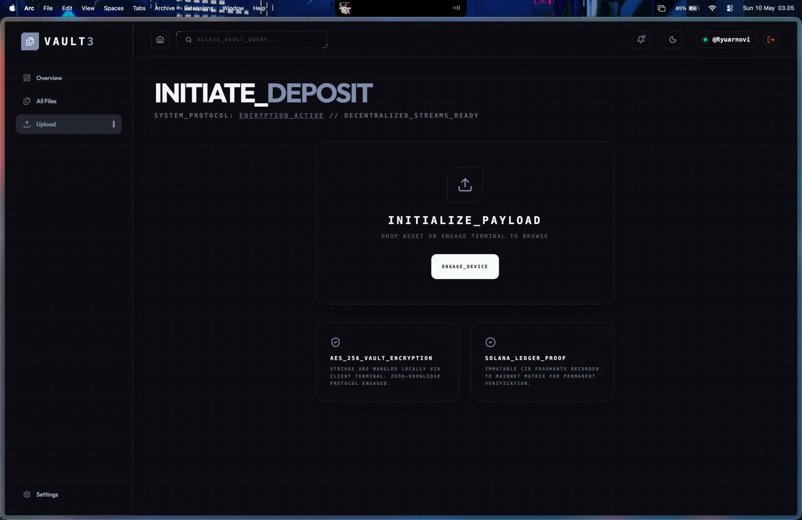
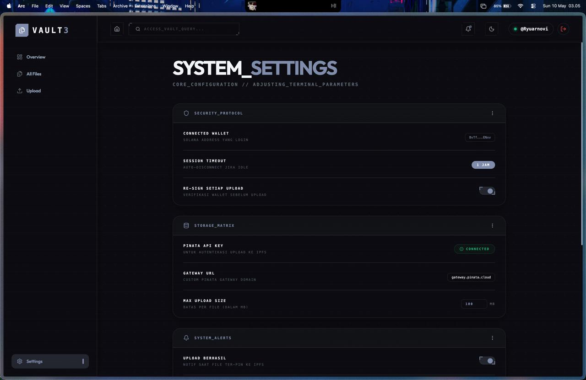

# Vault3 - Secure Web3 Personal Vault

Vault3 is a decentralized, end-to-end encrypted personal file storage solution built on Solana and IPFS (via Pinata).






## Core Features

- End-to-End Encryption: Files are processed locally in the browser using AES-256 before transmission.
- Resilient IPFS Retrieval: Multi-gateway fallback system (Cloudflare, IPFS.io, Pinata) ensures reliable asset access.
- Smart MIME Detection: Automatic file type identification ensures images and PDFs open directly in-browser.
- Solana Identity Protocol: Access control linked directly to Solana wallet signatures.
- High-Fidelity UI: Professional HUD-style interface with glassmorphism and motion design.
- Local Inventory Indexing: Persistent local tracking of file metadata and CIDs.

## System Architecture & Workflow

Vault3 operates on a Zero-Knowledge Architecture principle, ensuring that sensitive data and encryption keys never leave the client-side environment.

# 🛰️ Vault3 Architecture Overview

```text
┌──────────────────────────────────────────────────────────────┐
│                  CLIENT TERMINAL (BROWSER)                   │
├──────────────────────────────────────────────────────────────┤
│                                                              │
│   ┌──────────────────┐                                       │
│   │ User Interface   │                                       │
│   │      (HUD)       │                                       │
│   └────────┬─────────┘                                       │
│            │                                                 │
│            ▼                                                 │
│   ┌──────────────────┐                                       │
│   │ Solana Wallet    │                                       │
│   │ Authentication   │                                       │
│   │  (Sign Message)  │                                       │
│   └────────┬─────────┘                                       │
│            │                                                 │
│            ▼                                                 │
│   ┌──────────────────┐                                       │
│   │ Local Encryption │                                       │
│   │    AES-256       │                                       │
│   └────────┬─────────┘                                       │
│            │                                                 │
│            ▼                                                 │
│   ┌──────────────────┐                                       │
│   │ CID Inventory    │                                       │
│   │  localStorage    │                                       │
│   └────────┬─────────┘                                       │
│            │                                                 │
│            ▼                                                 │
│   ┌──────────────────┐                                       │
│   │ JSON Export      │                                       │
│   │ Backup Utility   │                                       │
│   └──────────────────┘                                       │
│                                                              │
└──────────────────────┬───────────────────────────────────────┘
                       │
                       │ Encrypted Blob
                       ▼
┌──────────────────────────────────────────────────────────────┐
│                 NEXT.JS SERVERLESS API                       │
├──────────────────────────────────────────────────────────────┤
│                                                              │
│   ┌──────────────────┐       ┌──────────────────┐            │
│   │ Upload API Route │ ────▶ │ Authority        │            │
│   └──────────────────┘       │ Gatekeeper       │            │
│                              └────────┬─────────┘            │
│                                       │                      │
└───────────────────────────────────────┼──────────────────────┘
                                        │
                                        ▼
┌──────────────────────────────────────────────────────────────┐
│              DECENTRALIZED STORAGE LAYER                     │
├──────────────────────────────────────────────────────────────┤
│                                                              │
│   ┌──────────────────┐       ┌──────────────────┐            │
│   │ Pinata           │ ────▶ │ Global IPFS      │            │
│   │ IPFS Management  │       │ Network          │            │
│   └──────────────────┘       └──────────────────┘            │
│                                                              │
└──────────────────────────────────────────────────────────────┘
                       ▲
                       │ Wallet Signature Verification
                       │
┌──────────────────────────────────────────────────────────────┐
│                    SOLANA ECOSYSTEM                          │
├──────────────────────────────────────────────────────────────┤
│                                                              │
│            ┌───────────────────────────┐                     │
│            │ Solana Mainnet / Devnet   │                     │
│            └───────────────────────────┘                     │
│                                                              │
└──────────────────────────────────────────────────────────────┘
```

### Technical Workflow

1. **Authentication Phase**: Access is restricted via a Solana cryptographic handshake. The system validates the connected wallet address against a predefined authority list.
2. **Security Phase**: Files are encrypted at the source (locally) using AES-256. Plaintext data never leaves the user's device.
3. **Transmission Phase**: The encrypted binary blob is securely transmitted to the API layer, which acts as a bridge to the IPFS infrastructure.
4. **Decentralized Storage Phase**: Assets are pinned globally via Pinata. IPFS generates a unique Content Identifier (CID) for the encrypted asset.
5. **Retrieval & Decryption**: When accessed, the system attempts to fetch the asset via a priority list of IPFS gateways. Upon successful retrieval, it applies smart MIME detection and decrypts the binary stream locally for secure viewing or download.
6. **Inventory Sync**: The resulting metadata is stored in a persistent local manifest for tracking and future zero-knowledge retrieval.

## Technical Stack

- Framework: Next.js (Turbopack)
- Blockchain: Solana (@solana/web3.js)
- Storage: IPFS via Pinata
- Styling: Vanilla CSS & Framer Motion
- Design System: HUD-inspired glassmorphism

## Getting Started

### Prerequisites

- Node.js 18+
- Solana Wallet (e.g., Phantom)
- Pinata API Keys

### Environment Setup

Refer to the `.env.example` file for the required configuration parameters. Copy this to a `.env` file in your root directory:

```bash
cp .env.example .env
```

### Installation

```bash
npm install
npm run dev
```

## Security Statement

Vault3 is designed so that encryption keys are never transmitted or stored on any server. Even in the event of a storage provider compromise, stored assets remain unreadable without the local metadata and original wallet authority.

## License

MIT
